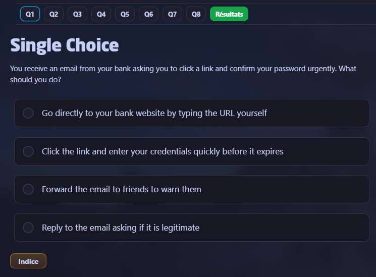
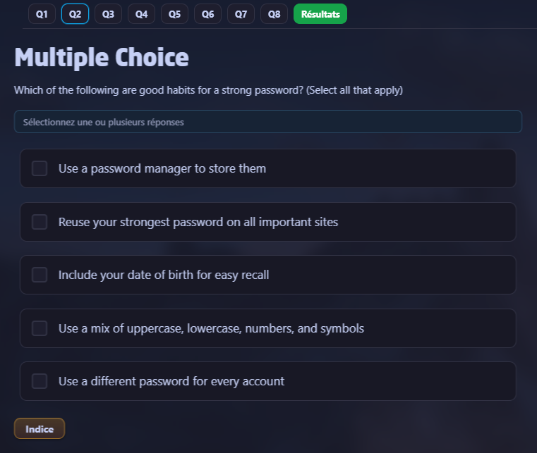
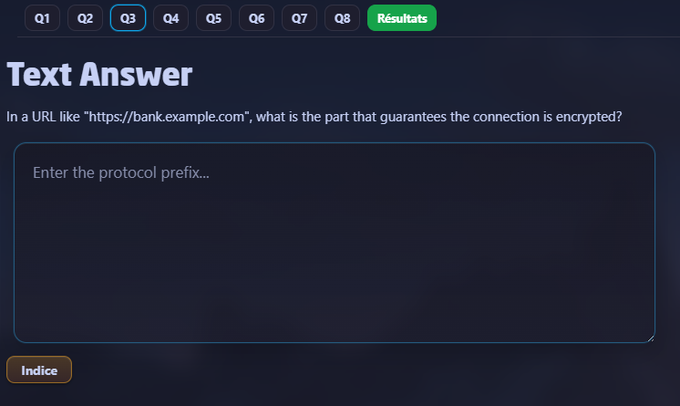
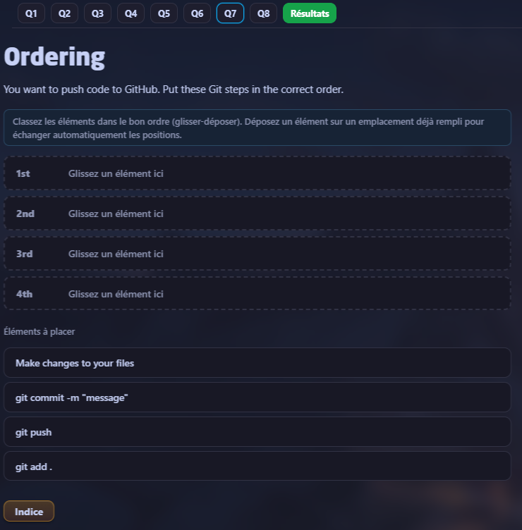
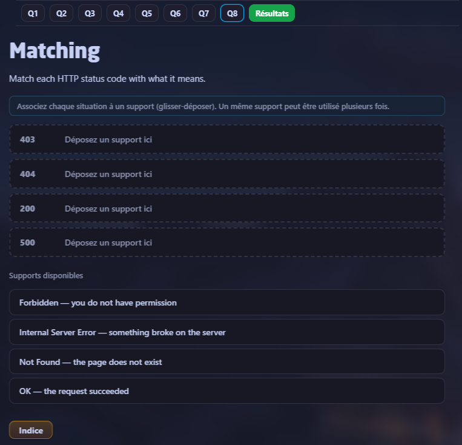
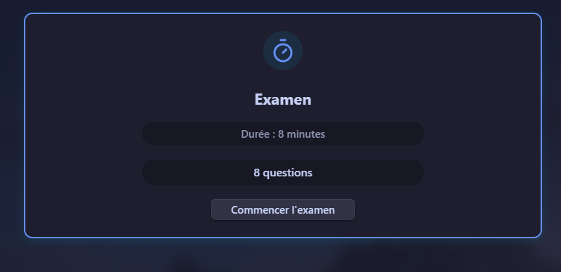
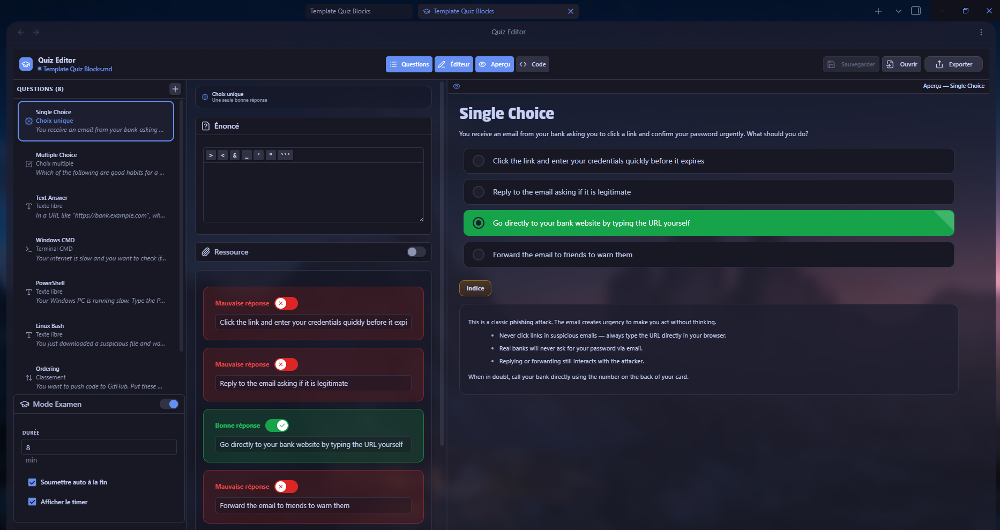

# Quiz Blocks [](https://github.com/AhmedMili952/quiz-blocks/releases)

Render ` ```quiz-blocks ` code blocks into fully interactive quizzes directly inside Obsidian notes.

---

## How it works

You describe a quiz using a JSON5 code block. The plugin transforms it into a rich interactive form with multiple question types, a visual editor, exam mode, and more. There is a **Check** button that highlights right, wrong, and missed answers, with optional `hint` and `explanation` commentary. Great for self-education, certification prep, and learning notes.

---

## Supported question types

### Single Choice — one correct answer



### Multiple Choice — several correct answers



### Text Input — free text with validation



### Command Line — terminal simulation (CMD / PowerShell / Bash)


### Ordering — drag & drop to arrange items



### Matching — pair items from two columns



---

## Exam Mode



Add an exam configuration object anywhere in your quiz array to enable timed sessions with a countdown timer and auto-submit.

---

## Visual Editor



Press `Ctrl+Shift+E` (or click the 🎓 icon in the ribbon) to open the **Quiz Editor** — build and edit quizzes without writing any code.

- ➕ Add questions via the **"+"** button
- 🎨 Choose from all supported question types
- ✏️ Edit content visually
- ↕️ Reorder questions with drag & drop
- 💾 Auto-saves changes directly to your note

---

## Installation

**Quiz Blocks** can be installed manually from GitHub.

<details><summary>Show steps</summary>

1. Go to the [Releases](https://github.com/AhmedMili952/quiz-blocks/releases) page and download the latest release.
2. Extract the ZIP file.
3. Copy the extracted folder into your vault's plugin directory:
   ```
   YOUR_VAULT/.obsidian/plugins/quiz-blocks/
   ```
4. Restart Obsidian or go to **Settings → Community plugins** and click **Reload plugins**.
5. Enable **Quiz Blocks** from the list.

</details>

---

## Keyboard Shortcuts

| Shortcut | Action |
|----------|--------|
| `Ctrl+Shift+E` | Open Quiz Editor |
| `Ctrl+Shift+Q` | Open quiz from active note |
| `↑` / `↓` | Navigate between questions |
| `Space` / `Enter` | Select highlighted answer |

---

## Notes & limitations

This plugin is in active beta development — bugs are possible. Feel free to [open an issue](https://github.com/AhmedMili952/quiz-blocks/issues/new) and share feedback.

- Answers are not persisted between sessions
- The visual editor requires the note to be in edit mode
- The `esbuild.config.mjs` build path is configured for a local Obsidian vault — adjust it for your setup

---

## Try it yourself

Want to test all question types at once in your vault?

👉 **[Copy the full demo template](https://github.com/AhmedMili952/quiz-blocks/blob/main/demo-template.md)** — open the file, click the **Copy** button, paste it into a new Obsidian note, and the quiz is ready to run.

---

If you find this plugin useful, please consider starring the repository ⭐️

<br>
<br>
